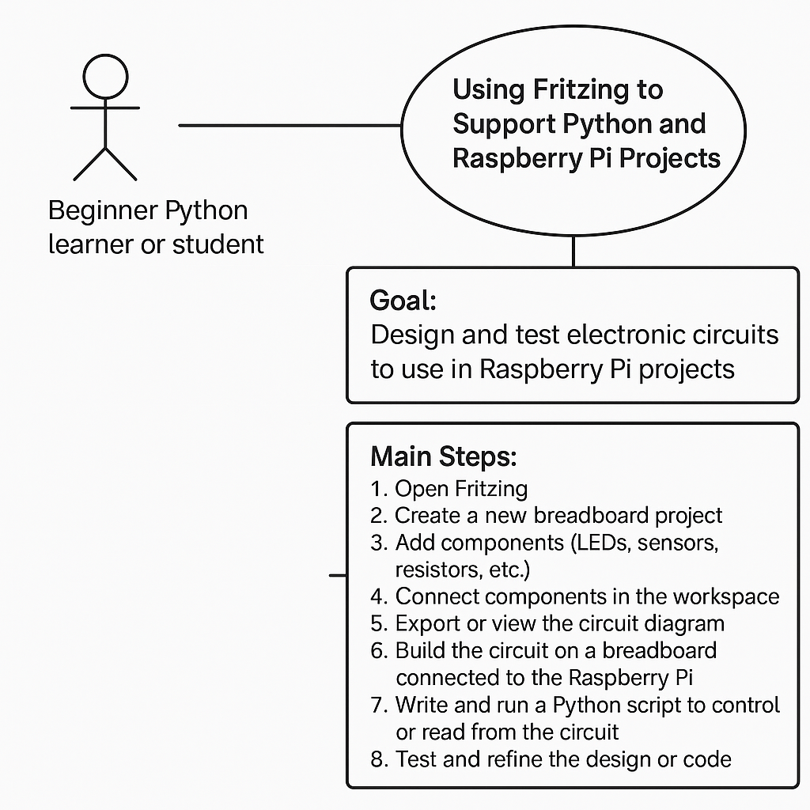

# Pi Project Tutorial


#### Electronic Design Automation (EDA) for Arduino & Raspberry Pi Projects


[Fritzing website & download](https://fritzing.org/)

**Fritzing is a user-friendly tool for designing and documenting electronics projects, including those involving the Raspberry Pi.** It allows you to visually lay out circuits using a breadboard view, create schematic diagrams, and even design printed circuit boards (PCBs) for fabrication.


**For Raspberry Pi projects, Fritzing can help you:**

* Map out connections between the Pi and components like sensors, LEDs, and motors.
* Create clear diagrams for sharing with others or for use in teaching and presentations.
* Prototype circuits before physically assembling them, reducing errors and improving understanding.
* Design custom PCBs if you're building a more permanent or professional version of your project.

It’s particularly useful for beginners and educators, as it simplifies the process of circuit design and makes electronics more accessible.


**Using Fritzing**

Practical application of using Fritzing or other similar packages and platforms. 



| **Element**          | **Description**                                                                                                                                                                                                                                                                                                                                                                            |
| -------------------- | ------------------------------------------------------------------------------------------------------------------------------------------------------------------------------------------------------------------------------------------------------------------------------------------------------------------------------------------------------------------------------------------ |
| **Actor**            | Beginner Python learner or student                                                                                                                                                                                                                                                                                                                                                         |
| **Goal**             | Design and test electronic circuits for Raspberry Pi projects                                                                                                                                                                                                                                                                                                                              |
| **Preconditions**    | Fritzing is installed<br>Raspberry Pi setup is ready<br>Learner knows basic Python syntax                                                                                                                                                                                                                                                                                            |
| **Main Steps**       | 1. Open Fritzing<br>2. Create a new breadboard project<br>3. Add components such as LEDs, sensors, and resistors<br>4. Connect components in the workspace<br>5. Export or view the circuit diagram<br>6. Build the circuit on a breadboard connected to the Raspberry Pi<br>7. Write and run a Python script to control or read from the circuit<br>8. Test and refine the design or code |
| **Postconditions**   | Working circuit diagram<br>Functional Raspberry Pi project controlled with Python                                                                                                                                                                                                                                                                                                      |
| **Alternative Path** | If the circuit fails, use Fritzing to trace and correct wiring errors before retesting                                                                                                                                                                                                                                                                                                     |

Now we look at the practical steps of using diagrams to support our learning projects. This example focuses on a simple project to make an LED light blink.


[sunfounder.com Turorials & Support](https://docs.sunfounder.com/projects/davinci-kit/en/latest/python_pi5/pi5_1.1.1_blinking_led_python.html)


```
from gpiozero import LED
from time import sleep

# Initialize an LED connected to GPIO pin 17 using the GPIO Zero library.
led = LED(17)


while True:
    # Turn on the LED and print a message to the console.
    led.on()
    print('LED ON')

    # Wait for 0.5 seconds with the LED on.
    sleep(0.5)

    # Turn off the LED and print a message to the console.
    led.off()
    print('LED OFF')

    # Wait for 0.5 seconds with the LED off.
    sleep(0.5)
```


**Reference list**
ERIC BREDDER, 2018. Intro to Arduino: Part 1 - Fritzing [viewed 18 October 2025]. [Available from: https://youtu.be/QqRfAlI2Xh8?si=suqppn7eaBByHGXn](https://youtu.be/QqRfAlI2Xh8?si=suqppn7eaBByHGXn)

BAVERSTOCK, T., 2019. Fritzing Tutorial - A Beginners Guide to Making Circuit & Wiring Diagrams. YouTube [https://youtu.be/-saXw1EipX0?si=-JqlR0xO2HNOr9e1](https://youtu.be/-saXw1EipX0?si=-JqlR0xO2HNOr9e1)

NERD MUSICIAN, 2021. Fritzing Tutorial for Beginners - How to Design your Circuits and Diagrams [viewed 18 October 2025]. Available from: [https://www.youtube.com/watch?v=P-OdzSiqRm8](https://www.youtube.com/watch?v=P-OdzSiqRm80